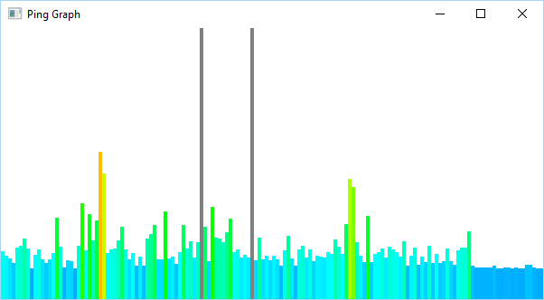

# PingGraph

Simple rust utility to graph ping over time.

Just wraps the os supplied ping utility while using piston (OpenGL)for rendering. It is tested to work on Windows and Linux, but probably works on osx too.

It pings google.com by default, which should always redirect to localised version, giving values between 30 and 100ms for most users.
